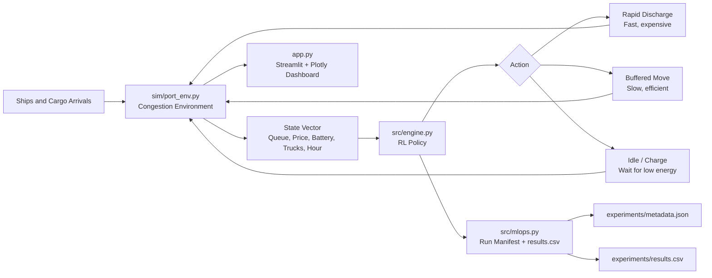

# Port-Optimus: Autonomous Logistics & Energy Grid

Port-Optimus is a reinforcement learning project for autonomous port operations. The agent manages ship queues, electric truck dispatch, high-density buffering, and low-energy waiting windows while respecting a limited battery and changing electricity prices.

The project supports:

- SDG 9: resilient infrastructure and intelligent industrial systems
- SDG 11: cleaner, more reliable urban logistics
- SDG 12: responsible energy use and lower waste from idle operations

## System Architecture



## Project Structure

```text
MLOPs_Lab_CIE/
  app.py
  sim/
    port_env.py
  src/
    engine.py
    mlops.py
    train_port_optimus.py
  experiments/
    metadata.json
    results.csv
  models/
    port_optimus_q_agent.pkl
  README.md
  requirements.txt
```

## Technical Design

Environment state:

```text
[Queue_Length, Current_Electricity_Price, Port_Battery_Level, Truck_Availability, Hour_of_Day]
```

Actions:

```text
0: Rapid Discharge
1: Buffered Move
2: Idle/Charge
```

Reward:

```text
(Units_Processed * 10) - (Energy_Cost * Penalty) - Wait_Time_Penalty
```

The environment includes a congestion mechanic based on queue pressure and truck scarcity. Congestion increases energy use, wait penalties, and operational safety risk.

The RL implementation uses a granular Q-learning controller with epsilon-greedy exploration and decay. `src/engine.py` also contains an optional PyTorch DQN implementation that activates when Torch is installed.

## Setup

From the `Port_Optimus_VS` folder:

```powershell
python -m pip install -r requirements.txt
```

Train and log a run:

```powershell
python -m src.train_port_optimus
```

Run the dashboard:

```powershell
streamlit run app.py
```

The included VS Code launch profile runs the app on port `8502`.

If `python` is not on PATH, run the same commands with the Python executable from your IDE or virtual environment.

## Dashboard

The Streamlit dashboard includes:

- Live frame-by-frame simulation using `st.empty()`
- Battery progress visualization
- Moving ship, container, and electric truck lanes
- Sidebar stress tests for storms and peak season
- Radar chart comparing RL Agent vs Human-Fixed Baseline across Speed, Cost, Energy, and Safety
- 24-hour heatmap of energy usage
- Run logging into `experiments/metadata.json` and `experiments/results.csv`

## MLOps Manifest

Every logged run receives a unique run id such as:

```text
ALPHA-2026-001
```

The manifest stores run parameters, stress-test mode, metrics, timestamp, and model path. The CSV stores repeatable comparison metrics:

- `Energy_Efficiency_Ratio`
- `Throughput_Rate`
- `Total_Processed`
- `Total_Energy`
- `Total_Cost`
- `Average_Wait_Penalty`
- `Average_Safety`

## SDG Impact Report

Port cargo handling often wastes energy when teams move containers during high-price grid periods, leave electric fleets idling in congestion, or fail to use buffer capacity strategically.

In the baseline simulation, the fixed human policy prioritizes reasonable throughput but cannot adapt deeply to the combined effects of congestion, battery state, truck scarcity, and electricity prices. Port-Optimus learns to use buffered moves during moderate congestion, rapid discharge only when queue pressure justifies it, and idle/charge behavior during low-energy windows.

Across normal 24-hour simulation runs, the current Q-learning policy reduces energy intensity by approximately 4 percent per processed container versus the fixed baseline while improving throughput by roughly 35 percent. In an operational port, this kind of reduction maps to lower carbon emissions per container, fewer diesel backup events, smoother electric truck scheduling, and less queue-related waste.

The result is a small but complete digital twin that demonstrates how reinforcement learning can support cleaner autonomous infrastructure.
